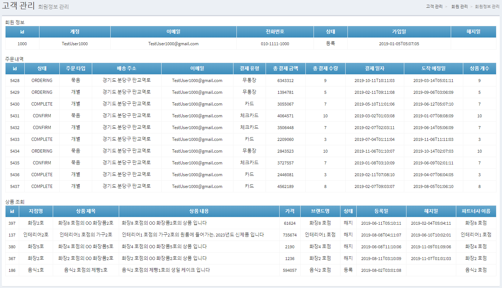

# 어드민 페이지
## 개발 목표
* 쇼핑몰에서 사용자가 아이템을 구매하거나 관리자가 외부 업체를 관리할 수 있는 어드민 페이지
* 관리자, 사용자, 장바구니, 주문내역, 상품, 파트너사, 상품 카테고리에 대한 API를 제공한다.
* Spring Boot, JPA, Thymeleaf, Vue.js, MySQL, Maven을 이용

## ERD

## 실제 페이지
 
 
 
